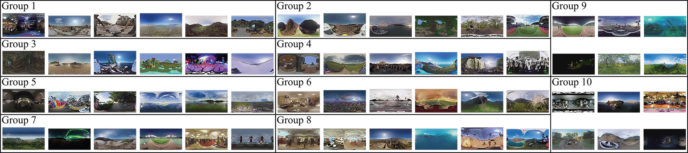
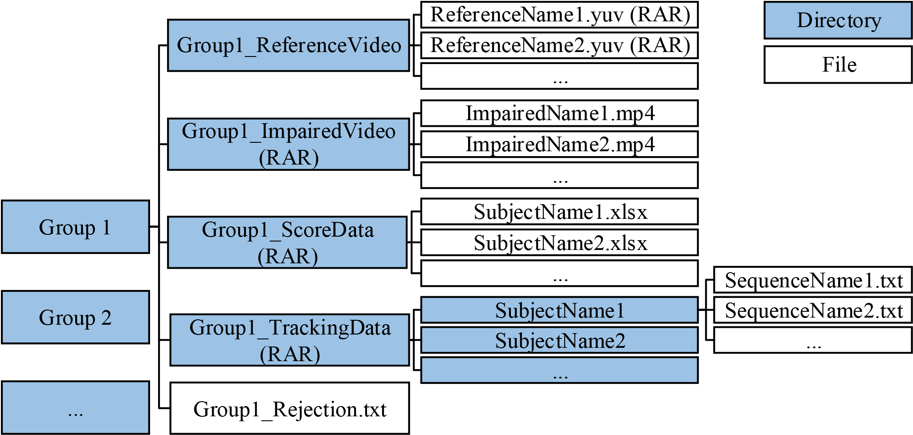

# VQA-ODV
A large-scale VQA dataset of omnidirectional video proposed in ACMMM 2018 paper.
> Chen Li, Mai Xu*, Xinzhe Du, Zulin Wang. 2018. [Bridge the Gap Between
VQA and Human Behavior on Omnidirectional Video: A Large-Scale Dataset
and a Deep Learning Model](https://arxiv.org/abs/1807.10990). In 2018 ACM Multimedia Conference (MM ’18),
October 22–26, 2018, Seoul, Republic of Korea. ACM, New York, NY, USA,
9 pages. https://doi.org/10.1145/3240508.3240581

## Citation
If you use VQA-ODV in your research, please cite:
```
@inproceedings{Li:2018:BGB:3240508.3240581,
 author = {Li, Chen and Xu, Mai and Du, Xinzhe and Wang, Zulin},
 title = {Bridge the Gap Between VQA and Human Behavior on Omnidirectional Video},
 subtitle = {A Large-Scale Dataset and a Deep Learning Model},
 booktitle = {Proceedings of the 2018 ACM on Multimedia Conference},
 series = {MM '18},
 year = {2018},
 isbn = {978-1-4503-5665-7},
 location = {Seoul, Republic of Korea},
 numpages = {9},
 url = {https://doi.org/10.1145/3240508.3240581},
 doi = {10.1145/3240508.3240581},
 acmid = {3240581},
 publisher = {ACM},
 address = {New York, NY, USA},
 keywords = {omnidirectional video, visual quality assessment, human behavior},
} 
```

  

## Introduction

VQA-ODV is a large-scale dataset of omnidirectional video for visual quality assessment (VQA). There is in total **600** omnidirectional video sequences in VQA-ODV, of which 60 are reference sequences in diverse content.
The dataset is organized as follow.

More details can be found in our ACMMM 2018 paper.

## Copyright

We do not own the copyright of the video sequences.
`G7PressConference`,`G7Shooting`,`G8Pagoda`,`G8Salon`,`G9ConcertLive`,`G9DrivingInCity`,`G9FootballMatch`,`G9GreatWall`,`G10BoatInPark`, `G10BuddhaCave`,`G10DrivingInCountry`,`G10XiaoGuang` are provided and owned by Letin VR Digital Technology Co., Ltd.
Others are collected from [YouTube](https://www.youtube.com/) and owned by their original uploaders.
For researchers and educators who wish to use the video sequences for non-commercial research and/or educational purposes, we can provide access under certain conditions and terms. 

The following uses are allowed for the proposed sequences:
> 1. Can be published in technical papers, played at technology research and development events.
> 2. Can be used by Standards committees. (e.g., SMPTE, ITU, MPEG, VQEG).

The following uses are NOT allowed for the proposed sequences:
> 1. Do not publish snapshots in product brochures.
> 2. Do not use video for marketing purposes
> 3. Do not redistribute video with a commercial product.
> 4. Do not use in television shows, commercials, or movies.

## Download
Please send email in the format as follow:

> * SUBJECT: VQA-ODV
> * TO: dataset[at]buaamc2[dot]net

Or you can use [this hyperlink](mailto:dataset@buaamc2.net?subject=VQA-ODV&body=Anything%20to%20say) to send the email.
After sending the email, you are supposed to receive the response **immediately** with the download link and the password for unzipping. If not, please check whether it is identified as spam by your ESP.
